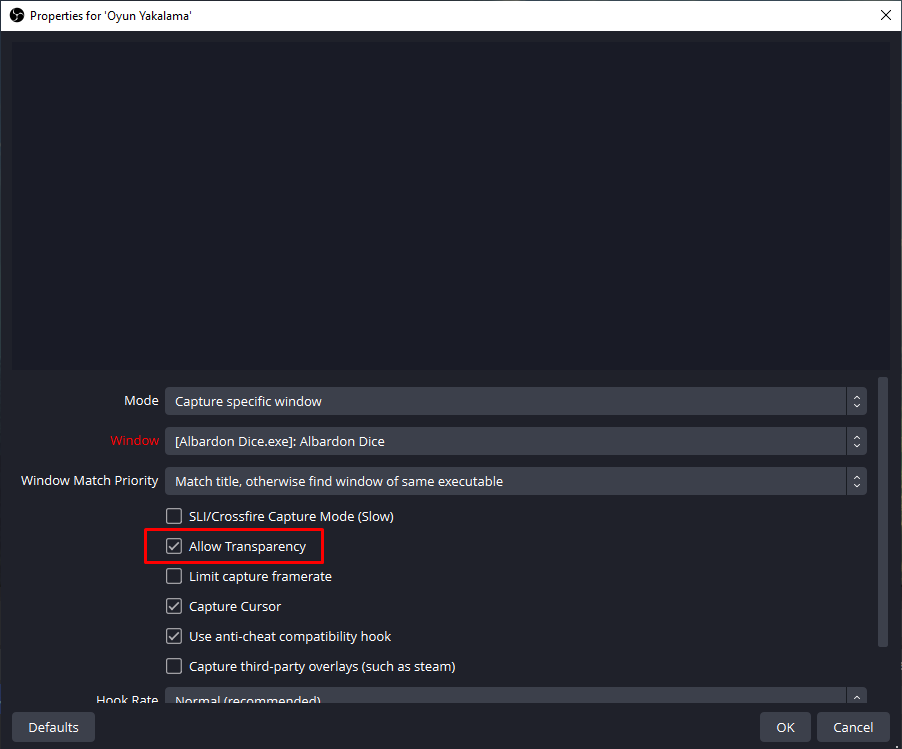

# Albardon Dice Roller

A versatile and interactive DnD Dice Roller application built with Unity, designed to enhance tabletop RPG sessions. Features customizable dice sets, physics-based rolling animations, and result tracking for immersive gameplay.

## Features

- **Physics-based d20 Rolling**: Simulate the roll of a d20 with physics-based animations for a realistic feel.
- **Result Tracking**: Automatically displays the result of each dice roll.
- **Keyboard Shortcuts**: Quick and easy dice rolling with keyboard shortcuts.

## Getting Started

### Prerequisites

- Unity 2023.2.16f1 or later for editing the project.
- Git for version control.

### Installation

1. **Clone the repository**:
`git clone https://github.com/behluluysal/albardon-dnd-dice-tool.git`

2. **Open the project in Unity**:

Launch Unity Hub, click on 'Add', and select the cloned project directory.

3. **Add the scene**
Navigate to '\Assets\Scenes' and add MainScene. 

4. **Build and Run the project**:

Inside Unity, navigate to `File > Build and Run`. Choose your preferred platform and follow the prompts to complete the build process.

## How to Use

- **Running the App**: Navigate to `\Demo` and run `Albardon Dice.exe`
- **Selecting the Dice**: Press `Q`, `W`, `E`, `R`, or `T` to select a d20 dice. The application currently supports only the d20 dice type.
- **Selecting Die Count**: Simply press `1`, `2`, `3`, `4` or `5` to select the number of dice you want to roll.
- **Rolling the Dice**: Once selected, press `Space` to roll the dice. The result of the roll will be displayed on the screen.
- **Clearing the Dice**: To remove all dice from the screen and prepare for another roll, press `Backspace`. This clears the field instantly, allowing for a quick new roll.

## Using with Obs
- **Adding Source**: In Obs you can capture the dice roller. Since the background is transparent you can add the source on top of your dnd backgrounds and dice will be displayed upon your board.

## Contributing

Your contributions make the open-source community an amazing place for creativity and innovation. If you have a suggestion that would improve this project, please fork the repository and create a pull request. You can also simply open an issue with the tag "enhancement".

1. Fork the Project.
2. Create your Feature Branch (`git checkout -b feature/AmazingFeature`).
3. Commit your Changes (`git commit -m 'Add some AmazingFeature'`).
4. Push to the Branch (`git push origin feature/AmazingFeature`).
5. Open a Pull Request.

## License

This project is licensed under the MIT License - see the `LICENSE` file for details.

## Credits

- Thanks to Unity Technologies for the Unity Engine, enabling the creation of this application.
- Dice Sound: https://freesound.org/people/andresix/sounds/347807/
- Dice Ding: https://freesound.org/people/f-r-a-g-i-l-e/sounds/447141/
- Critical Fail Sound: https://pixabay.com/sound-effects/violin-lose-1-175615/
- Critical Success Sound: https://pixabay.com/sound-effects/diamond-found-190255/
- Tutorial: https://github.com/FFaUniHan/ReForge_Labs_Dice_RNG_Manipulation
- Icosahedron Model: https://sketchfab.com/3d-models/d20-dice-w20-wurfel-3d-model-free-3b44541db43e4e979efec290ec706cbc
